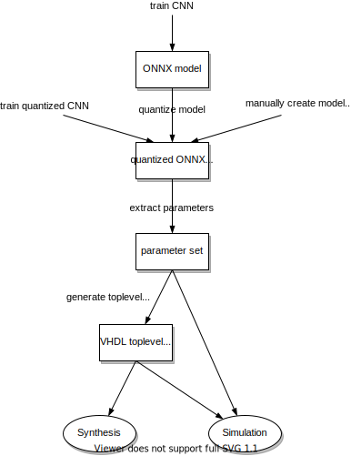
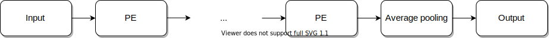

# pocket-cnn

[](https://github.com/marph91/pocket-cnn/actions?query=workflow%3Atestsuite)
[](https://codecov.io/gh/marph91/pocket-cnn)
[](https://github.com/marph91/pocket-cnn/actions?query=workflow%3Asynthesis)
[](https://github.com/marph91/pocket-cnn/actions?query=workflow%3Acheck_scripts)
[](https://github.com/marph91/pocket-cnn/actions?query=workflow%3Avhdl_style)

pocket-cnn is a framework to map small Convolutional Neural Networks (CNN) fully on a FPGA. There is no communication outside the FPGA needed, except of providing the image and reading the result.

## Installation and Usage

Before using the framework, the `PYTHONPATH` has to be extended by `path/to/pocket-cnn/code/python_tools`. A complete end-to-end example can be found at the [example folder](examples/end_to_end/README.md).

For running the tests, [ghdl](https://github.com/ghdl/ghdl), [vunit](https://github.com/vunit/vunit), [onnx](https://github.com/onnx/onnx) and [fpbinary](https://github.com/smlgit/fpbinary) are required. For debugging, [gtkwave](https://github.com/gtkwave/gtkwave) and [netron](https://github.com/lutzroeder/netron) are useful. To run the full testsuite, simply execute:

```bash
cd code/vhdl/sim/vunit
python3 run_all.py
```

### Workflows

This section describes the different workflows. In the end-to-end example, an ONNX model gets trained with pytorch, quantized and processed until it's ready for synthesis by pocket-cnn.
There are some other workflows. At first, the quantized ONNX model can be directly trained in the CNN framework. This requires that the framework supports the quantization of pocket-cnn. The rest of the workflow is the same as described above.
Another branch in the workflow is to create ONNX models manually. This doesn't have any relevance for real models, but is really useful for testing. I. e. small ONNX models can be created fastly without any training. This allows to test (i. e. simulate) multiple configurations extensively. The test models are defined in the [model zoo](code/python_tools/cnn_onnx/model_zoo.py).



### Supported layers

| Layer | Properties | Limitations |
| :---: | :--- | :--- |
| Convolution | <ul><li>Kernel: 1x1, 2x2, 3x3, 5x5</li><li>Stride: 1, 2, 3</li></ul> | Quantization of the activations and weights: Scale has to be power of two, zero point has to be zero. |
| Maximum Pooling | <ul><li>Kernel: 2x2, 3x3</li><li>Stride: 1, 2, 3</li></ul> | - |
| Global Average Pooling | - | The averaging factor is quantized to the 16 bit fixed point value of `1 / height * width`. |
| Zero Padding | - | The padding has to be the same at each edge. |
| (Leaky) ReLU | - | Leaky ReLU has a fixed alpha of 0.125 |

### Limitations

Before using the framework, you should be aware of several limitations:

- It is not complete. There might be several bugs and things missing. Please open an issue.
- There will be a different accuracy and loss due to the 8 bit quantization.
- Only small CNN can be synthesized, because the weights get mapped to LUT.
- Only a [subset of layers](#supported-layers) is supported.

### Interface

Most of the toplevel generics are describing the CNN architecture. They get derived from the ONNX model and don't need to be specified manually by the user. A table, containing the most important toplevel generics and signals, can be found [here](doc/toplevel_interface.md). The communication protocol is similar in all submodules of this design.

## Architecture

pocket-cnn accepts ONNX models as input. Each convolution layer of the CNN gets converted to a processing element (PE). This is the central element of the hardware design.
The convolution in a PE can be preceeded by *zero padding* and followed by *ReLU* and/or *maximum pooling*. See also [pe.vhd](code/vhdl/src/pe.vhd). Below are a few common configurations.


The python framework takes care of converting the ONNX model into the VHDL representation. The VHDL toplevel can be found at [top.vhd](code/vhdl/src/top.vhd). The toplevel structure is illustrated in the following image.



More details about the specific modules can be found [here](doc/modules.md).

## TODO

Can be found at the [documentation folder](doc/todo.md) and in the issues.

## Related work

- Haddoc2: <https://github.com/DreamIP/haddoc2>, <https://arxiv.org/pdf/1712.04322.pdf>
